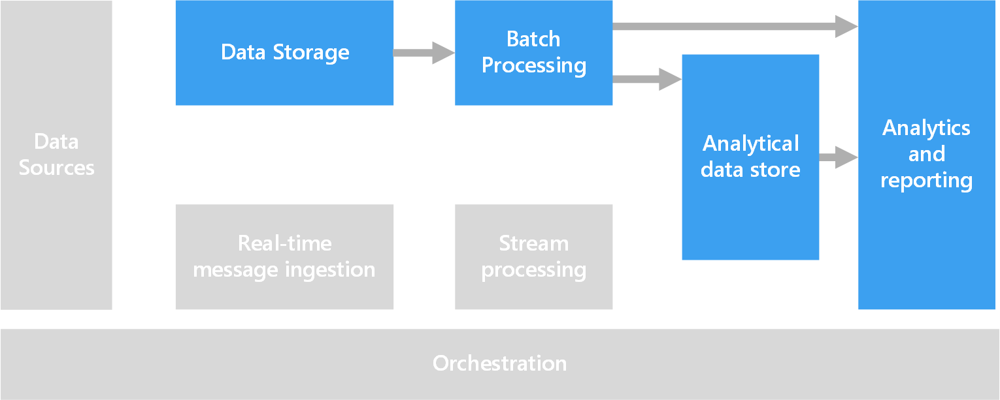

# Interactive data exploration

In many corporate business intelligence (BI) solutions, reports and semantic models are created by BI specialists and managed centrally. Increasingly, however, organizations want to enable users to make data-driven decisions. Additionally, a growing number of organizations are hiring *data scientists* or *data analysts*, whose job is to explore data interactively and apply statistical models and analytical techniques to discren trends and patterns in the data. Interactive data exploration requires tools and platforms that provide low-latency processing for ad-hoc queries and data visualizations.

## Self-service BI

Self-service BI is a name given to a modern approach to business decision making in which users are empowered to find, explore, and share insights from data across the enterprise. To accomplish this, the data ecosystem must support:
* Discovery of business data sources through a data catalog.
* Master data management to ensure consistency of data entity defintions and values.
* Interactive data modeling and visualization tools for business users.

In a self-service BI solution, business users typically find and consume data sources that are relevant to their particular area of the business, and use intuitive tools and productivity applications to define personal data models and reports that they can share with their colleagues.

Relevant Azure service:
- [Azure Data Catalog](/azure/data-catalog/data-catalog-what-is-data-catalog)
- Microsoft Office 365 - in particular Excel and Power Pivot
- [Microsoft Power BI](https://powerbi.microsoft.com/)

## Data science experimentation
When an organization requires advanced analytics and predictive modeling, the initial preparation work is usually undertaken by specialist data scientists who explore the data and apply statistical analytical techniques to find relationships between data *features* and the desired predicted *labels*. Such data exploration is typically conducted using programming languages such as Python or R that natively support statistical modeling and visualization. Typically, the scripts used to explore the data are hosted in specialized environments such as Jupyter Notebooks to enable data scientists to explore the data programmatically while documenting and sharing the insights they find.

Relevant Azure service:  
- [Azure Notebooks](https://notebooks.azure.com/)
- [Azure Machine Learning Studio](/azure/machine-learning/studio/what-is-ml-studio)
- [Azure Machine Learning Experimentation Services](/azure/machine-learning/preview/experimentation-service-configuration)
- [The Data Science Virtual Machine](/azure/machine-learning/data-science-virtual-machine/overview)

## Architecture

Although the goal of this scenario is to support interactive data analysis, the data cleansing, sampling, and structuring tasks involved in data science often include long-running processes. That makes a [batch processing](./batch-processing.md) architecture appropriate.

## Technology choices

Typical technologies used for interactive data exploration include:

### Data storage

- Azure Storage Blob Containers or Azure Data Lake Store. Data scientists generally work with raw source data, to ensure they have full visibility of all possible features, outliers, and errors in the data. In a Big Data scenario, this data usually takes the form of files in a data store.

For more information, see [Data storage](../technology-choices/data-storage.md).

### Batch processing

- R Server and/or Spark. Most data scientists use programming languages with strong support for mathematical and statistical packages, such as R or Python to work with data. When working with large volumes of data, using platforms that enable these languages to use distributed processing techniques reduces latency. R Server can be used on its own or in conjunction with Spark to scale out R processing functions, and Spark natively supports Python for similar scale-out capabilities in that language.
- Hive. Hive is a good choice for transforming data using SQL-like semantics. Users can create and load tables using HiveQL statements, which are semantically similar to SQL. Azure 
Analytical Data Store
- Spark SQL. Spark SQL is an API built on Spark that supports the creation of dataframes and tables that can be queried using SQL syntax. Regardless of whether the data files to be analyzed are raw source files or new files that have been cleaned and prepared by a batch process, users can define Spark SQL tables on them for further querying an analysis. 
- Hive. In addition to batch processing raw date by using Hive, you can create a Hive database that contains Hive tables and views based on the folders where the data is stored, enabling interactive queries for analysis and reporting. HDInsight includes an Interactive Hive cluster type that uses in-memory caching to reduce Hive query response times. Users who are comfortable with SQL-like syntax can use Interactive Hive to explore data.

For more information, see [Batch processing](../technology-choices/batch-processing.md).

### Analytics and reporting

- Jupyter. Jupyter Notebooks provides a browser-based interface for running code in languages such as R, Python, or Scala. When using R Server or Spark to batch process data, or when using Spark SQL to define a schema of tables for querying, Jupyter can be a good choice for querying the data. When using Spark, you can use the standard Spark dataframe API or the Spark SQL API as well as embedded SQL statements to query the data and produce visualizations.
- Interactive Hive Clients. If use an Interactive Hive cluster to query the data, you can use the Hive view in the Ambari cluster dashboard, the Beeline command line tool, or any ODBC-based tool (using the Hive ODBC driver), such as Microsoft Excel or Power BI.

For more information, see [Data analytics and reporting technology](../technology-choices/analysis-visualizations-reporting.md).