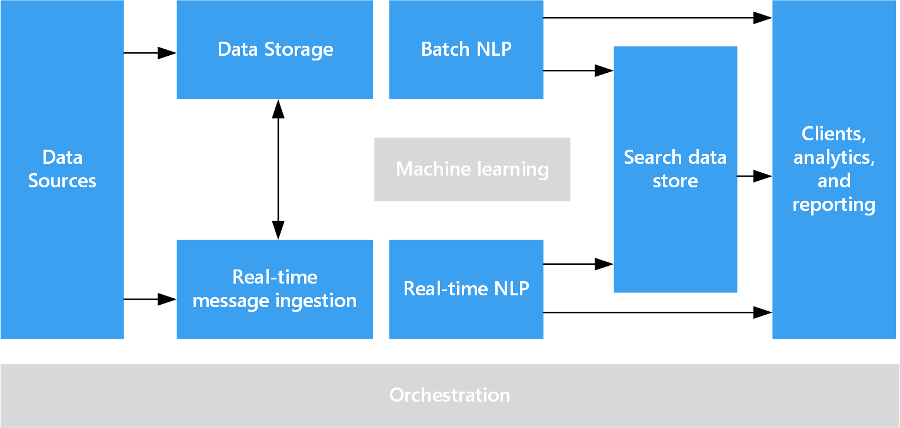

# Natural language processing

Natural language processing (NLP) is used for tasks such as sentiment analysis, topic detection, language detection, key phrase extraction, and document categorization.

## When to use this solution

NLP can be use to classify documents, such as labeling documents as sensitive or spam to support subsequent processing or search. Another use for NLP is summarization of text content by identifying the entities present in the document. On their own, the important entities in the document can be used to tag the documents with keywords enabling search and retrieval. The entities might themselves be combined into topics, and the summarization instead describes the important topics present in each document. The detected topics may be used to categorize the documents for navigation, or to enumerate related documents given a selected topic. Alternately, the text may be scored for sentiment to assess the positive or negative tone of the document. These approaches use many techniques from natural language processing, such as: 

- **Tokenizer**: Splitting the text into words or phrases.
- **Stemming and lemmatization**: normalizing words so that that different forms map to the canonical word with the same meaning. For example, "running" and "ran" map to "run." 
- **Entity extraction**: identifying subjects in the text.
- **Part of speech detection**: identifying text as a verb, noun, participle, verb phrase, and so on.
- **Sentence boundary detection**: detecting complete sentences within paragraphs of text.

When using NLP to extract information and insight from free-form text, the starting point is typically the raw documents stored within object storage such as Azure Storage or Azure Data Lake Store. 

## Architecture

In an NLP solution, free-form text processing is performed against documents containing paragraphs of text. The overall architecture can be a [batch processing](./batch-processing.md) or [real-time stream processing](./real-time-processing.md) architecture. 

The actual processing that applies NLP techniques varies based on the desired outcome, but in terms of the pipeline may be applied in a batch or real-time fashion. For example, sentiment analysis can be used against blocks of the text to produce a sentiment score, and can typically done either in batch against data in storage or in real time against smaller data flowing through messaging services. 

## Challenges

- Processing a collection of free-form text documents is typically computationally resource intensive, as well as being time intensive.
- In the absence of a standardized document format, it can be very difficult to achieve consistently accurate results using free-form text processing to extract specific facts from a document. For example, think of a text representation of an invoice&mdash;it can be difficult to build a process that correctly extracts the invoice number and invoice date for invoices across any number of vendors.

## Technology choices

- [Natural language processing](../technology-choices/natural-language-processing.md)