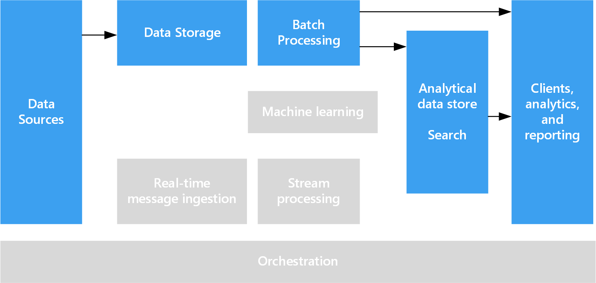

# Processing free-form text for search

To support search, free-form text processing can be performed against documents containing paragraphs of text.

A query is built containing the text the documents need to contain and a result set is produced consisting of a list of documents sorted by how well the content of each document matches the search criteria. The query is executed against a specialized index that is precomputed against the collection of documents. The result set may also include the context in which the the document matches the criteria, which enables hit-highlighting in search results user interfaces that extract and highlight the matching phrase in the document. 

Free-form text processing has the benefit that it can produce useful, actionable data from large amounts of noisy text data. The results can give unstructured documents a well-defined and queryable structure.

## Challenges

- Processing a collection of free-form text documents is typically computationally resource intensive, as well as being time intensive.
- Querying of free-form processed data tends to trade precision for robustness. For example, search indexes are built with lemmatization and linguistic stemming so that queries for "run" will match documents that contain "ran" and "running."

## Architecture

In most situations the source text documents are loaded into object storage such as that provided by Azure Storage or Azure Data Lake Store. The primary exception to this is when using full text search within SQL Server or Azure SQL Database. In this case, the document data is loaded into tables managed by the database.

Once stored, the documents are processed in a batch to create the index. All services have some mechanism that, provided a path to the collection of documents, will populate a search index. Azure Search provides indexers that can automatically populate the index for provided documents ranging from plain text, to Excel and PDF formats. On HDInsight, Apache Solr can index binary files of many types, including plain text, Word, and PDF. Full text search in SQL Server populates the index from text, binary, or XML data stored within the same database. 

Once the index is constructed, services typically expose a search interface by means of a REST API. This is true for Azure Search, ElasticSearch, and HDInsight with Solr. Documents indexed by SQL Server or Azure SQL Database are searched using T-SQL queries. 

## Technology choices

- [Search data stores](../technology-choices/search-options.md)
